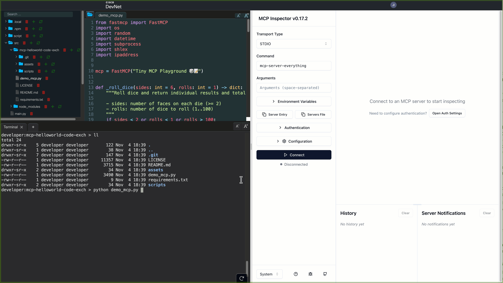
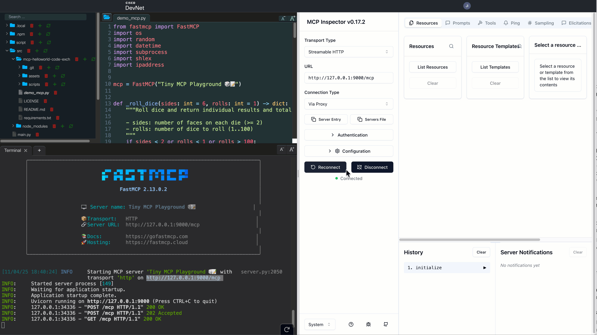
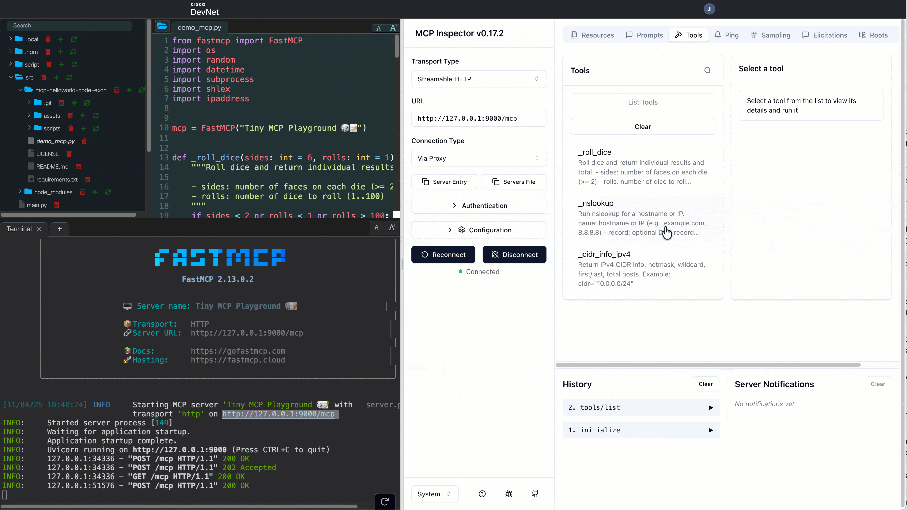

# MCP HelloWorld for Code Exchange – integrated MCP Inspector Demo
MCP HelloWorld for Code Exchange with web MCP Inspector. This repo contains a tiny FastMCP server and a simple demo that you can run locally or instantly in Cisco DevNet CodeExchange DevEnv. It showcases three small tools that are handy for quick testing and network workflows: `roll_dice` (random dice), `nslookup` (DNS lookup wrapper), and `cidr_info_ipv4` (IPv4 subnet facts). Use the "Run MCP Inspector IDE in Cloud" button to launch a preconfigured environment, then open the included MCP Inspector to invoke the tools.

## Demo

### Load MCPs
Instantly connect your MCP server to the Inspector and work side-by-side—no window-switching needed.



### Show tools
Explore all available MCP tools through the Inspector's intuitive GUI for a seamless discovery experience.



### Run live tests
Select any tool, add inputs, and execute—bringing your entire build-deploy-test loop together in one place.



## Try it in Cisco DevNet DevEnv (no local setup)
Click to launch a browser-based environment with this repo pre-cloned and FastMCP preinstalled:

[](https://developer.cisco.com/codeexchange/devenv/npateriya/mcp-helloworld-code-exch/)

Once the DevEnv opens:
- Change working dir `cd mcp-helloworld-code-exch`
- Install requirements `pip install -r requirements.txt`
- Start the server (HTTP on 9000) if needed: `python demo_mcp.py`
  - MCP server endpoint: `http://127.0.0.1:9000/mcp` (transport: streamable-http)
- On right side of IDE in MCP Inspector, configure below settings and `Connect` to local MCP server.
  - Transport Type : Streamable HTTP
  - URL : http://127.0.0.1:9000/mcp
- Go to Tools tab, list tools, and try out:
  - `roll_dice`
  - `nslookup`
  - `cidr_info_ipv4`

### Local run (quick)
If you prefer local instead of DevEnv:
```bash
python3 -m venv .venv
source .venv/bin/activate
python -m pip install -r requirements.txt
python demo_mcp.py
```

## What this demo provides
- **roll_dice(sides=6, rolls=1)**: Returns individual dice results and total.
- **nslookup(name, record?, server?, timeout=5.0)**: Wraps the system `nslookup` for quick DNS checks. Returns `ok`, `exit_code`, `command`, `stdout`, `stderr`.
- **cidr_info_ipv4(cidr)**: IPv4-only CIDR facts like netmask, wildcard, first/last IP, and total addresses.

## Requirements
- `nslookup` available on your system (macOS has it by default). Verify with: `which nslookup`.

## Run as HTTP (Streamable) on port 9000
The script is configured to start an HTTP MCP server on `http://127.0.0.1:9000/mcp`.

```bash
source .venv/bin/activate
python demo_mcp.py
```

Health checks / quick probes:
- Base server: `curl -i http://127.0.0.1:9000/`
- MCP endpoint (expects MCP client payloads): `curl -i http://127.0.0.1:9000/mcp` (GET may return 406; that still confirms the endpoint is up.)

## Tool reference
### cidr_info_ipv4
Input:
```json
{ "cidr": "10.0.0.0/24" }
```
Output:
```json
{
  "cidr": "10.0.0.0/24",
  "netmask": "255.255.255.0",
  "wildcard": "0.0.0.255",
  "first_ip": "10.0.0.0",
  "last_ip": "10.0.0.255",
  "total_hosts": 256
}
```

### nslookup
Inputs (examples):
```json
{ "name": "example.com" }
{ "name": "example.com", "record": "AAAA" }
{ "name": "example.com", "record": "A", "server": "8.8.8.8" }
```

### roll_dice
Input:
```json
{ "rolls": 3 }
```
Output:
```json
{ "sides": 6, "rolls": 3, "results": [2, 6, 5], "total": 13 }
```
